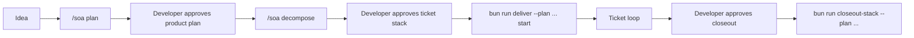

# Delivery Workflow

The happy path is deliberately strict:



## Gate 1: Product Plan Approval

`/soa plan` turns an idea into a product plan. The important output is a durable file under `docs/product/plans/`.

For product-scope work, the plan must be pressure-tested with `soa-grill-me` before acceptance. The point is to surface assumptions before implementation starts.

## Gate 2: Ticket Approval

`/soa decompose <plan>` turns the approved product plan into:

- `implementation-plan.md`
- ordered ticket files
- dependencies and risk notes
- red-gate expectations

The developer approves this stack before branches are created.

## Execution

The primary entrypoint is:

```bash
bun run deliver --plan docs/product/delivery/phase-NN/implementation-plan.md start
```

The orchestrator reads the plan, creates or resumes ticket worktrees, writes handoff files, drives state transitions, and tells the agent exactly what the next command is.

## Gate 3: Phase Closeout

Stacked ticket PRs are not auto-merged. Closeout is explicit:

```bash
bun run closeout-stack --plan docs/product/delivery/phase-NN/implementation-plan.md
```

That command lands the completed stack on the configured closeout branch. The developer decides when this happens.

## Standalone PRs

Not every change needs a full phase. Small bounded fixes, docs updates, and cleanup can use standalone delivery:

```bash
bun run deliver triage-standalone
```

Standalone does not mean careless. It means the work is small enough that the ticket-state machinery would be heavier than the change.

