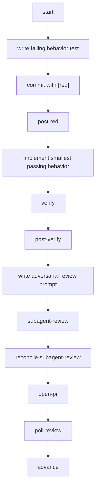

# Ticket Loop

Each code ticket follows a red/green/refactor rhythm with review gates attached.



## Red Comes Before Green

For behavior-changing code tickets:

1. Write one failing test through a public interface.
2. Commit it with a `[red]` suffix.
3. Run `post-red`.
4. Implement only enough code to pass.

Tickets with no testable behavior declare `Red: skip`.

## Verify Before Review

The usual inner loop is:

```bash
bun run verify:quiet
```

Before publishing a PR, run the broader check expected by the repo, usually:

```bash
bun run ci:quiet
```

## Handoffs

Every ticket gets a handoff under:

```text
.agents/delivery/<plan-key>/handoffs/<ticket-id>.md
```

Read it before resuming. It is the durable context for the active slice.

## Why The Loop Is So Explicit

The sequence prevents three common failures:

- implementing before proving the behavior gap
- publishing before a cold review pass
- claiming review was clean when git history says otherwise

This is why the order matters. The orchestrator is a state machine, not a suggestion list.

